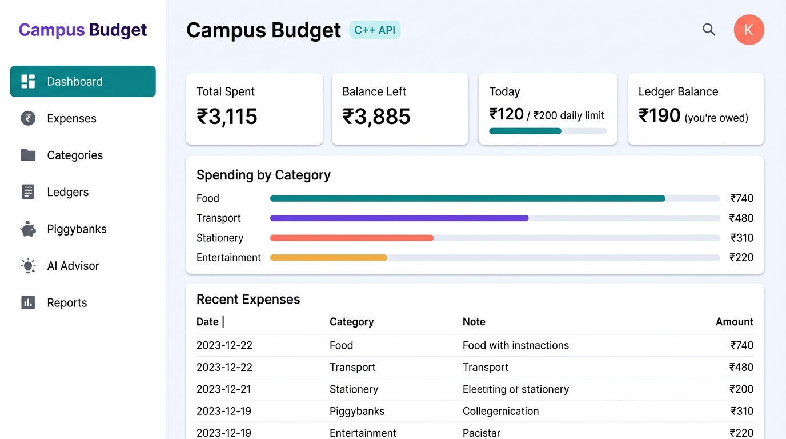
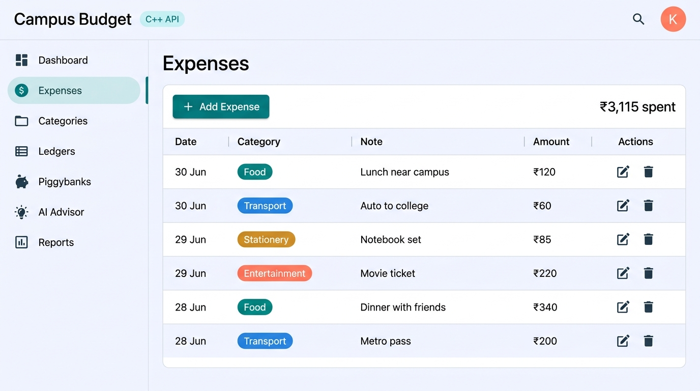
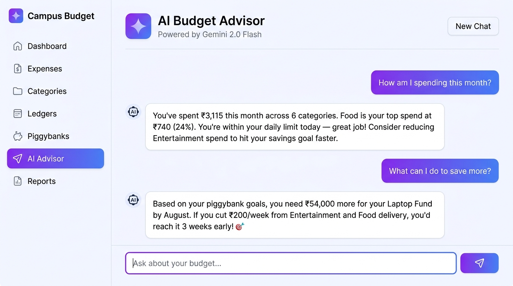

# 🎓 Campus Budget App

> **A full-stack college expense tracker built as a resume / Object-Oriented Programming showcase.**
> Flutter web frontend · C++ OOP backend · Gemini AI advisor · REST API bridge

---

## 📌 Resume Description

A full-stack expense-tracking application for college students featuring a polished Flutter web UI,
a C++ object-oriented domain backend, and a real-time Gemini AI chat advisor.
Demonstrates encapsulation, abstraction, composition, and the manager-class design pattern
across seven domain classes (Expense, BudgetManager, LedgerEntry, LedgerManager,
Piggybank, PiggybankManager, ReportGenerator), tested with 4 suites of assertion-based unit tests,
and connected to the Flutter frontend via a custom C++ HTTP REST API.

---

## 🏗️ Architecture

```
┌─────────────────────────────────────────────┐
│            Flutter Web Frontend             │
│  lib/screens/  +  lib/services/             │
│  (Dart, browser localStorage OR backend)    │
└──────────────┬──────────────────────────────┘
               │  HTTP (localhost:8080)
               │  ApiService.dart  ←──────────────────────────┐
               ▼                                              │
┌─────────────────────────────────────────────┐              │
│        C++ HTTP API Server                  │              │
│  backend/server/main.cpp                    │              │
│  Winsock2/WinINet + nlohmann/json           │              │
└──────────────┬──────────────────────────────┘              │
               │  C++ OOP Domain Layer                        │
               ▼                                              │
┌─────────────────────────────────────────────┐              │
│  BudgetManager  LedgerManager               │              │
│  PiggybankManager  ReportGenerator          │              │
│  (src/*.cpp  ←  include/campus/*.hpp)       │              │
└──────────────┬──────────────────────────────┘              │
               │  JSON file persistence                       │
               ▼                                              │
        backend/data/budget_data.json                        │
                                                             │
┌─────────────────────────────────────────────┐              │
│   External: Gemini Flash-Lite API           │◄─────────────┘
│   (AI Advisor chat, lib/services/ai_service)│
└─────────────────────────────────────────────┘
```

---

## ✨ Features

### Flutter Frontend
| Feature | Description |
|---------|-------------|
| 📊 Dashboard | Total spent, daily limit, income, balance, category breakdown |
| 🧾 Expenses | Add / edit / delete expenses with category and date |
| 🗂️ Categories | Budget limits per category with progress bars |
| 👥 Ledgers | Friend money tracking (who owes whom) |
| 🐷 Piggybanks | Savings goals with deposit / withdraw |
| 🤖 AI Advisor | Real-time Gemini chat with live budget context |
| 📈 Reports | Visual spending breakdown and summaries |
| 💾 Persistence | Browser localStorage OR C++ backend (switchable) |

### C++ Backend
| Class | OOP Role |
|-------|----------|
| `Expense` | Value object — encapsulates date, category, note, amount |
| `BudgetManager` | Manager class — add/update/delete/total/category logic |
| `LedgerEntry` | Value object — friend name and signed balance |
| `LedgerManager` | Manager class — upsert/remove/net-balance logic |
| `Piggybank` | Stateful object — deposit/withdraw, progress calculation |
| `PiggybankManager` | Manager class — CRUD + deposit/withdraw delegation |
| `ReportGenerator` | Utility class — cross-manager text summary |

---

## 📸 Screenshots

| Dashboard | Expenses |
|-----------|----------|
|  |  |

**AI Budget Advisor** — real-time Gemini Flash-Lite chat with live budget context:



---

## 🧠 OOP Concepts Demonstrated

| Concept | Where |
|---------|-------|
| **Encapsulation** | All fields are `private`; access only via const getter methods |
| **Abstraction** | Manager classes hide internal `std::vector` and `std::map` from callers |
| **Composition** | `BudgetManager` owns `ExpenseRecord` structs; `PiggybankManager` owns `GoalRecord` structs |
| **Single Responsibility** | Each class has one job (store, manage, or report) |
| **Manager Pattern** | `BudgetManager`, `LedgerManager`, `PiggybankManager` follow the same pattern |
| **Value Objects** | `Expense`, `LedgerEntry` are immutable-style data containers |
| **Separation of Concerns** | Domain logic in C++, UI in Flutter, persistence separate |

---

## 🗂️ Project Structure

```
campus_budget_app/
├── lib/                          # Flutter frontend
│   ├── screens/
│   │   ├── dashboard/
│   │   ├── expenses/
│   │   ├── categories/
│   │   ├── ledgers/
│   │   ├── piggybanks/
│   │   ├── ai_advisor/           ← Real-time Gemini chat
│   │   └── reports/
│   ├── services/
│   │   ├── expense_service.dart  ← Core business logic (Dart)
│   │   ├── expense_store.dart    ← Storage abstraction
│   │   ├── api_service.dart      ← HTTP client for C++ backend
│   │   ├── backend_expense_store.dart
│   │   └── ai_service.dart       ← Gemini API client
│   └── models/
│       ├── expense.dart
│       ├── ledger.dart
│       ├── piggybank.dart
│       └── income_entry.dart
│
├── backend/                      # C++ OOP backend
│   ├── include/campus/           ← Header files (public API)
│   │   ├── Expense.hpp
│   │   ├── BudgetManager.hpp
│   │   ├── LedgerEntry.hpp
│   │   ├── LedgerManager.hpp
│   │   ├── Piggybank.hpp
│   │   ├── PiggybankManager.hpp
│   │   └── ReportGenerator.hpp
│   ├── src/                      ← Implementations
│   ├── server/
│   │   └── main.cpp              ← HTTP API server (15 endpoints)
│   ├── tests/
│   │   └── backend_tests.cpp     ← 4 assertion-based test suites
│   ├── data/
│   │   └── budget_data.json      ← Runtime JSON persistence (gitignored)
│   └── CMakeLists.txt
│
└── test/                         # Flutter tests
    ├── expense_service_test.dart
    └── widget_test.dart
```

---

## 🚀 How to Run

### 1. Flutter Frontend (Local Storage mode — no backend needed)

```bash
flutter pub get
flutter run -d chrome
```

### 2. C++ Backend API Server

**Prerequisites:** MinGW `g++` 6.3+ with C++14 support  
**First-time setup** (download nlohmann/json single-header):

```powershell
New-Item -ItemType Directory -Force backend/server, backend/data
Invoke-WebRequest https://github.com/nlohmann/json/releases/download/v3.10.5/json.hpp `
  -OutFile backend/server/json.hpp
```

**Build and run:**

```powershell
g++ -std=c++14 -I backend/include -I backend/server `
    backend/server/main.cpp backend/src/*.cpp `
    -o backend/campus_budget_server.exe -lws2_32 -lwininet

$env:GEMINI_API_KEY="YOUR_KEY_HERE"
.\backend\campus_budget_server.exe
# → Campus Budget API server running on http://localhost:8080
```

**Or with CMake:**

```powershell
cmake -S backend -B backend/build
cmake --build backend/build
.\backend\build\campus_budget_server.exe
```

### 3. Run C++ Unit Tests

```powershell
g++ -std=c++17 -I backend/include `
    backend/tests/backend_tests.cpp backend/src/*.cpp `
    -o backend/campus_budget_tests.exe

.\backend\campus_budget_tests.exe
# → (exits 0 = all 4 test suites passed)
```

### 4. Run Flutter Tests

```bash
flutter test          # 15 tests
flutter analyze       # 0 issues
```

### 5. AI Advisor Setup

1. Get a free Gemini API key from [aistudio.google.com](https://aistudio.google.com/apikey)
2. Set it in the terminal before running the C++ backend:
   ```powershell
   $env:GEMINI_API_KEY="YOUR_KEY_HERE"
   ```
3. Navigate to the **AI Advisor** tab in the app

---

## 🔌 API Reference

Base URL: `http://localhost:8080`

| Method | Endpoint | Description |
|--------|----------|-------------|
| `GET` | `/health` | Server health check |
| `GET` | `/expenses` | List all expenses |
| `DELETE` | `/expenses` | Clear all expenses |
| `POST` | `/expenses` | Add expense → `{"id": N}` |
| `PUT` | `/expenses/:id` | Update expense |
| `DELETE` | `/expenses/:id` | Delete expense |
| `GET` | `/ledgers` | List ledger entries |
| `DELETE` | `/ledgers` | Clear ledger entries |
| `POST` | `/ledgers` | Upsert friend balance |
| `DELETE` | `/ledgers/:name` | Remove ledger entry |
| `GET` | `/piggybanks` | List savings goals |
| `DELETE` | `/piggybanks` | Clear savings goals |
| `POST` | `/piggybanks` | Add savings goal |
| `PUT` | `/piggybanks/:id` | Update savings goal |
| `DELETE` | `/piggybanks/:id` | Delete savings goal |
| `POST` | `/piggybanks/:id/deposit` | Deposit into goal |
| `POST` | `/piggybanks/:id/withdraw` | Withdraw from goal |
| `GET` | `/reports/summary` | Dashboard summary JSON |

---

## 🛠️ Tech Stack

| Layer | Technology |
|-------|-----------|
| Frontend UI | Flutter 3 (Dart, Material 3) |
| Frontend state | Dart `ExpenseService` + browser localStorage |
| HTTP client (Dart) | `package:http` |
| AI chat | Gemini Flash-Lite API through C++ backend proxy |
| Backend language | C++17 |
| HTTP server | Custom lightweight Winsock2 HTTP server |
| JSON serialization | `nlohmann/json` (single header) |
| Backend persistence | JSON file (`budget_data.json`) |
| Build system | g++ (MinGW) + CMake |
| Testing (Flutter) | `flutter_test` |
| Testing (C++) | Assertion-based unit tests |

---

## 📋 What's Next (Optional Enhancements)

- [ ] Replace JSON file persistence with SQLite (`sqlite3.h`)
- [ ] Add user authentication (JWT or Firebase)
- [ ] Deploy Flutter to GitHub Pages / Firebase Hosting
- [ ] Deploy C++ API to a VPS with `systemd`
- [ ] Add AWS S3/DynamoDB for cloud storage
- [ ] Add charts to the Reports page (fl_chart)

---

*Built by Khushi Prashad — Campus Budget App v1.0*
